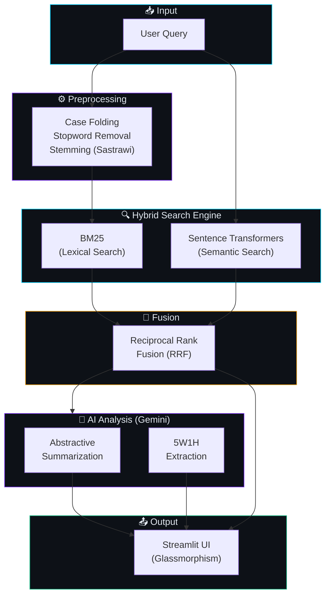

<div align="center">

<!-- Header -->


# 🧬 ChromoNews

### *News Retrieval using Hybrid BM25 & Semantic Search*
### *with AI Agent for Temporal Event Summarization*

<br/>

[](https://www.python.org/)
[](https://streamlit.io)
[](https://deepmind.google/technologies/gemini/)
[](/)

<br/>

<p>
  
  
  
  
</p>

---

**ChromoNews** adalah sistem pencarian berita yang menggabungkan pencarian leksikal (BM25) dan semantik menjadi satu pipeline **Hybrid Search**, lalu memanfaatkan **Google Gemini** untuk merangkum peristiwa secara kronologis dan mengekstrak elemen **5W1H** dari setiap artikel.

[Fitur](#-fitur-utama) •
[Arsitektur](#-arsitektur-sistem) •
[Instalasi](#-instalasi--penggunaan) •
[Tim](#-anggota-kelompok)

</div>

<br/>

## ✨ Fitur Utama

<table>
<tr>
<td width="50%">

### 🔍 Hybrid Search Engine
Menggabungkan dua paradigma pencarian menggunakan **Reciprocal Rank Fusion (RRF)**:

| Metode | Deskripsi |
|:---|:---|
| **BM25** (Lexical) | Pencocokan kata kunci eksak dengan preprocessing Bahasa Indonesia (stemming Sastrawi + stopword removal) |
| **Semantic Search** | Memahami konteks & makna menggunakan model `sentence-transformers` embedding |

</td>
<td width="50%">

### 🤖 Analisis & Ringkasan
Memanfaatkan **Google Gemini API** untuk mengolah hasil pencarian:

| Fitur | Deskripsi |
|:---|:---|
| **Abstractive Summary** | Merangkum inti dari berbagai artikel menjadi satu paragraf padat |
| **Chronological Timeline** | Menyusun urutan peristiwa berdasarkan waktu terbit |
| **5W1H Extraction** | Mengekstrak *What, Who, When, Where, Why, How* dari setiap artikel |

</td>
</tr>
</table>

<table>
<tr>
<td width="50%">

### 🎨 Modern UI (Glassmorphism)
Antarmuka elegan dibangun di atas **Streamlit** dengan:
- Custom CSS dengan Google Fonts (Inter & Outfit)
- Gradient accent & glassmorphism design
- Flat modern article cards dengan 5W1H inline badges
- Responsive layout dengan sidebar konfigurasi

</td>
<td width="50%">

### ⚡ Pipeline Teroptimasi
Arsitektur yang dirancang untuk performa tinggi:
- `@st.cache_resource` untuk caching model & index
- Pre-computed corpus embeddings (`.npy`)
- Preprocessing pipeline terpisah (offline)
- Configurable Top-K dan RRF constant

</td>
</tr>
</table>

<br/>

## 🏗 Arsitektur Sistem



> **Catatan:** Query untuk BM25 melewati preprocessing (case folding, stopword, stemming), sementara query untuk Semantic Search menggunakan teks asli agar model embedding menangkap makna secara utuh.

<br/>

## 🛠 Tech Stack

| Layer | Teknologi | Fungsi |
|:---|:---|:---|
| **Frontend** | Streamlit, Custom CSS | UI modern dengan glassmorphism |
| **Lexical Search** | rank-bm25, Sastrawi | BM25 indexing & Indonesian NLP |
| **Semantic Search** | sentence-transformers, NumPy | Dense vector similarity search |
| **Fusion** | Custom Python (RRF) | Reciprocal Rank Fusion scoring |
| **Summarizer** | Google Generative AI (Gemini) | Summarization & 5W1H extraction |
| **Data** | Pandas, scikit-learn | Data processing & analysis |

<br/>

## 📁 Struktur Proyek

```
ChromoNews/
├── 📄 app.py                    # Main Streamlit application
├── 📄 preprocess.py             # Text preprocessing pipeline (Indonesian NLP)
├── 📄 bm25_search.py            # BM25 index builder & search
├── 📄 semantic_search.py        # Semantic embedding & search
├── 📄 hybrid_search.py          # Reciprocal Rank Fusion (RRF)
├── 📄 summarizer.py             # Gemini summarizer & 5W1H extractor
├── 📄 tes_dataset.py            # Dataset testing utilities
├── 📊 cleaned_news_sample.csv   # Cleaned news dataset
├── 📊 preprocessed_news_sample.csv  # Preprocessed corpus
├── 🧠 corpus_embeddings.npy     # Pre-computed sentence embeddings
├── 📋 requirements.txt          # Python dependencies
├── 🔒 .env                      # API keys (not tracked)
└── 📄 .gitignore
```

<br/>

## 💻 Instalasi & Penggunaan

### Prasyarat

- **Python 3.9+** terinstal di sistem Anda
- **Google Gemini API Key** ([dapatkan di sini](https://aistudio.google.com/app/apikey))

### 🚀 Quick Start

```bash
# 1. Clone repository
git clone https://github.com/dekbintang/ChromoNews.git
cd ChromoNews

# 2. Buat virtual environment
python -m venv env

# Windows
.\env\Scripts\activate
# Mac/Linux
source env/bin/activate

# 3. Install dependencies
pip install -r requirements.txt

# 4. Konfigurasi API Key
#    Buat file .env di root proyek:
echo GEMINI_API_KEY=your_api_key_here > .env

# 5. Jalankan aplikasi
streamlit run app.py
```

> 💡 Aplikasi akan terbuka otomatis di browser pada `http://localhost:8501`

### ⚙️ Konfigurasi Runtime

Setelah aplikasi berjalan, Anda dapat mengatur parameter berikut melalui **sidebar**:

| Parameter | Default | Deskripsi |
|:---|:---|:---|
| **Gemini API Key** | - | API key untuk fitur Summarization |
| **Top-K Articles** | 5 | Jumlah artikel teratas yang di-retrieve |
| **RRF K Constant** | 60 | Smoothing constant untuk Reciprocal Rank Fusion |

<br/>

## 🔬 Contoh Penggunaan

Berikut beberapa contoh query yang dapat dicoba:

```
🔹 kasus korupsi KPK 2023
🔹 perkembangan kasus Rafael Alun pajak
🔹 dampak ekonomi Silicon Valley Bank
🔹 mudik lebaran 2023
```

Sistem akan mengembalikan:
1. **Top-K artikel** yang paling relevan (ranked by RRF score)
2. **Ringkasan abstraktif** dari keseluruhan topik
3. **Analisis 5W1H** untuk setiap artikel yang ditemukan

<br/>

## 👥 Anggota Kelompok

<div align="center">

Proyek ini dikembangkan oleh mahasiswa **Universitas Udayana**:

| NIM | Nama | 
|:---:|:---|
| `2405551034` | **I Komang Cahya Kertha Yasa** |
| `2405551049` | **I Kadek Bintang Adi Bimantara** |
| `2405551168` | **Trio Suro Wibowo** |
| `2405551019` | **Richard Christian Mozart Diazoni** |

</div>

<br/>
